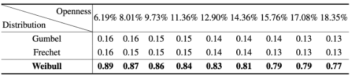

# Open-set
This repository includes code and data for comparing the F1-scores of three extreme value distributions: the Weibull, Gumbel, and Frechet distributions. Specifically, we pre-train two person identification models using our mmWave point cloud dataset and a publicly available dataset called mmGait[1]. We then use the top 20 distances between correctly classified training samples and class centers in the feature space to fit the Weibull, Gumbel, and Frechet distributions for each class, respectively. In the inference stage, the distributions for each class generate a value for each given distance, which is used to adjust and recompute the probability of the sample belonging to each class, including the unknown class. Following the metric calculation method defined in [2], F1-scores across 9 openness levels on our dataset are presented in Table I.

<div align="center">
    <em>Table I. F1-scores from three distributions across 9 openness levels on our dataset.</em><br>
    
</div>

Moreover, F1-scores across 9 openness levels on mmGait dataset are presented in Table II.

<div align="center">
    <em>Table II. F1-scores from three distributions across 9 openness levels on mmGait dataset.</em><br>
    
</div>

We have released the pre-trained model and testing data in releases, which can be used for performance testing. 

# Prerequisite for Evaluation

The overall model is implemented with Python 3.7.11 and Pytorch 1.10.0. Execute the following commands to configure the development environment.
* Create a conda environment called RTS based on Python 3.7.11, and activate the environment.
```
conda create -n Openset python=3.7.11
conda activate Openset
```
Install PyTorch, as well as other required packages, 
```
  pip3 install torch
  pip3 install numpy
  pip3 install scipy
```
Additionally, PyTorch3D and Limbr packets should be downloaded from GitHub for installation to avoid issues with pip3 installation.

Download or git clone the Open-set project. Download and unzip dataSampleCFAR005.zip and mmGaitSample.zip in releases to the project directory. 
```
   unzip dataSampleCFAR005.zip -d [Open-set root directory]
   unzip mmGaitSample.zip -d [Open-set root directory]
```
Download CFAR005.pth and mmGait.pth pret-rained models from releases and move them into the "Codes" folder. 

# Evaluation for Different Distributions

In total, we provide two datasets and three extreme distributions for evaluation. In the 'Codes' folder, 'openWeibullModel.py', 'openGumbelModel.py', and 'openFrechetModel.py' contain the code for evaluating the three different distributions, respectively. In the 'Records' folder, we provide training and testing data files for evaluation. The last number in each testing file represents the number of identities used for testing. Authors can replace the data files in the 'Records' folder to fit the distributions on different datasets and evaluate them at various openness levels.
